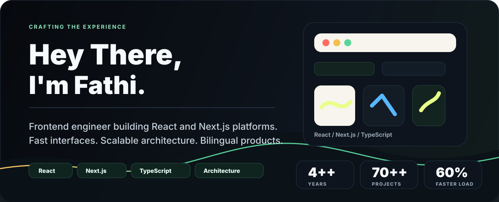
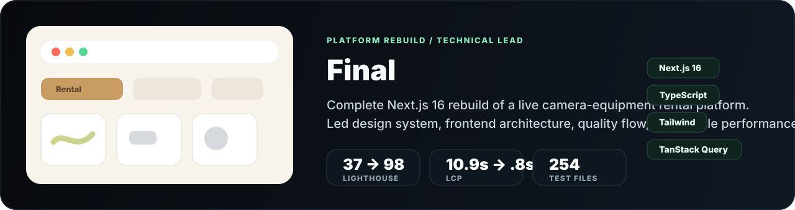
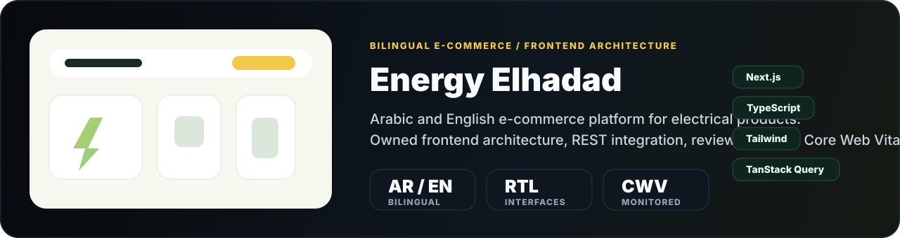
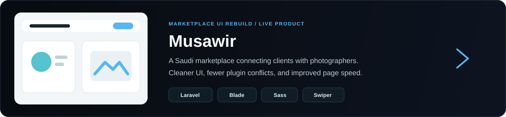
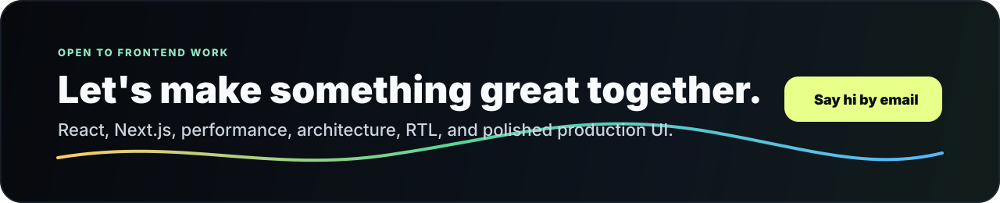

<<<<<<< HEAD
  
=======
  
>>>>>>> d32b645eff53231e986886d4b0b0de4a231a8f0c

  <a href="https://portfolio-eosin-rho-32.vercel.app/"><strong>Portfolio</strong></a>
  &nbsp;&nbsp;/&nbsp;&nbsp;
  <a href="https://www.linkedin.com/in/fathi-mohammed-999083326"><strong>LinkedIn</strong></a>
  &nbsp;&nbsp;/&nbsp;&nbsp;
  <a href="mailto:fathymohammed2229@gmail.com"><strong>Email</strong></a>
  &nbsp;&nbsp;/&nbsp;&nbsp;
  <a href="https://github.com/Fathi-Mohammed?tab=repositories"><strong>Repositories</strong></a>

 

<table width="100%">
  <tr>
    <td width="58%" valign="top">
      <h2>Frontend engineer building React and Next.js platforms.</h2>
      

        I build fast, scalable and maintainable web experiences with a strong focus on
        architecture, performance and polished user interfaces.
      

      

        My work sits where product quality meets engineering discipline: reusable UI systems,
        feature-based frontend architecture, bilingual AR/EN interfaces, and performance work
        that can be measured in real production numbers.
      

      

        <strong>I care about the parts users see, and the architecture they never see.</strong>
      

    </td>
    <td width="42%" valign="top">
      <table width="100%">
        <tr>
          <td><strong>Based in</strong></td>
          <td align="right">Mansoura, Egypt</td>
        </tr>
        <tr>
          <td><strong>Experience</strong></td>
          <td align="right">4++ years</td>
        </tr>
        <tr>
          <td><strong>Delivered</strong></td>
          <td align="right">70++ projects</td>
        </tr>
        <tr>
          <td><strong>Core stack</strong></td>
          <td align="right">React / Next.js / TS</td>
        </tr>
        <tr>
          <td><strong>Availability</strong></td>
          <td align="right">Open now</td>
        </tr>
      </table>
    </td>
  </tr>
</table>

 

## What I Do

<table width="100%">
  <tr>
    <td width="33%" valign="top">
      <h3>01. Frontend Engineering</h3>
      

        Feature-based React and Next.js architecture, clear domain boundaries, reusable
        components, and mapper layers that isolate backend DTOs from app-owned models.
      

    </td>
    <td width="33%" valign="top">
      <h3>02. Performance and SEO</h3>
      

        Core Web Vitals treated as product work: rendering strategy, bundle analysis,
        code splitting, optimized fonts, SVGs, metadata, and measurable Lighthouse gains.
      

    </td>
    <td width="33%" valign="top">
      <h3>03. Bilingual UI Systems</h3>
      

        Arabic-first AR/EN interfaces, full RTL mirroring, shared UI conventions, and
        component systems that teams can review and extend without friction.
      

    </td>
  </tr>
</table>

 

## Selected Work

  

  

  

 

## Experience Snapshot

<table width="100%">
  <tr>
    <td width="50%" valign="top">
      <h3>Business Building</h3>
      
<strong>React | Next Front-End Developer</strong>

      
Dec 2024 - Present / Mansoura

      <ul>
        <li>Architected a scalable Arabic-first bilingual Next.js platform with full RTL support.</li>
        <li>Introduced a mapper layer to keep backend DTOs separate from product domain models.</li>
        <li>Lifted Lighthouse performance from about 40 to about 98 and reduced initial load by about 60%.</li>
        <li>Set frontend conventions and code review flow for maintainable delivery.</li>
        <li>Built an Express.js and Puppeteer invoice API that paginates long tables correctly.</li>
      </ul>
    </td>
    <td width="50%" valign="top">
      <h3>Almasader Alraqmia</h3>
      
<strong>Front-End and UI/UX Developer</strong>

      
May 2023 - Dec 2024 / Mansoura

      <ul>
        <li>Delivered responsive, high-fidelity interfaces from Figma across multiple platforms.</li>
        <li>Built reusable React components integrated with TanStack Query for repeated workflows.</li>
        <li>Reduced feature development time by about 45% through shared UI and data-fetching patterns.</li>
        <li>Worked with QA through testing, fixes, and deployment to keep interfaces aligned with real flows.</li>
      </ul>
    </td>
  </tr>
</table>

 

## Core Stack

<table width="100%">
  <tr>
    <td width="25%" valign="top">
      <h3>Frontend</h3>
      

        <code>React</code> 
        <code>Next.js</code> 
        <code>TypeScript</code> 
        <code>JavaScript</code>
      

    </td>
    <td width="25%" valign="top">
      <h3>UI</h3>
      

        <code>Tailwind CSS</code> 
        <code>Sass</code> 
        <code>Ant Design</code> 
        <code>shadcn/ui</code>
      

    </td>
    <td width="25%" valign="top">
      <h3>Architecture</h3>
      

        <code>Feature-Sliced Design</code> 
        <code>Domain Modeling</code> 
        <code>Design Systems</code> 
        <code>Mapper Layers</code>
      

    </td>
    <td width="25%" valign="top">
      <h3>Workflow</h3>
      

        <code>TanStack Query</code> 
        <code>Redux Toolkit</code> 
        <code>NextAuth</code> 
        <code>Git / GitHub</code>
      

    </td>
  </tr>
</table>

 

## Current Focus

<table width="100%">
  <tr>
    <td width="33%" valign="top">
      <strong>Architecture that scales</strong>
      
Feature ownership, domain models, shared contracts, and UI systems that survive product growth.

    </td>
    <td width="33%" valign="top">
      <strong>Performance as a feature</strong>
      
Measured loading improvements, rendering decisions per page, and assets tuned for real users.

    </td>
    <td width="33%" valign="top">
      <strong>Arabic-first products</strong>
      
Clean RTL foundations, bilingual content flows, and interfaces that feel natural in both directions.

    </td>
  </tr>
</table>

 

  

  <a href="mailto:fathymohammed2229@gmail.com"><strong>Say Hi</strong></a>
  &nbsp;&nbsp;/&nbsp;&nbsp;
  <a href="https://portfolio-eosin-rho-32.vercel.app/"><strong>Portfolio</strong></a>
  &nbsp;&nbsp;/&nbsp;&nbsp;
  <a href="https://www.linkedin.com/in/fathi-mohammed-999083326"><strong>LinkedIn</strong></a>

